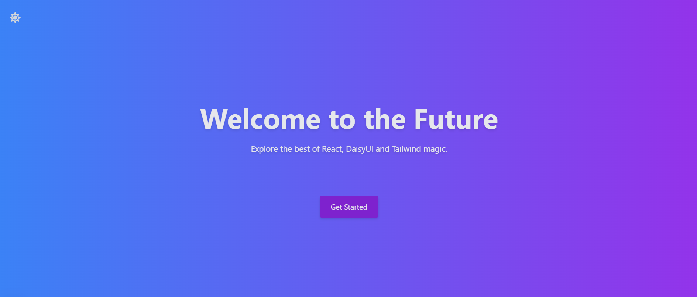
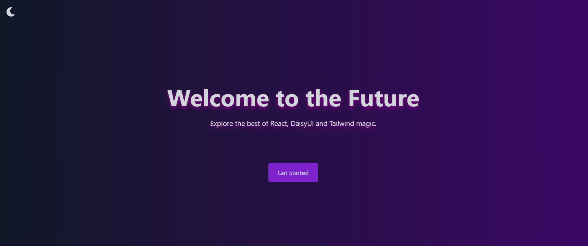
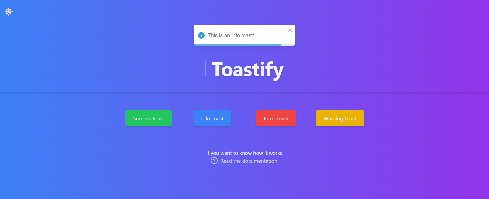
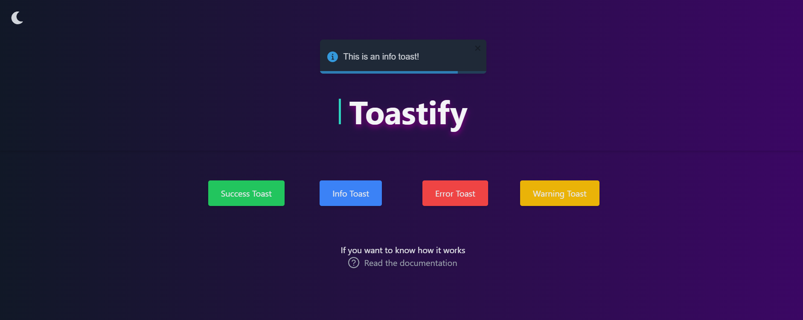

# **Demo App mit DaisyUI und Tailwind CSS**

Dies ist eine Demo-Anwendung, die entwickelt wurde, um moderne Frontend-Technologien zu demonstrieren. Sie kombiniert **DaisyUI**, **Tailwind CSS**, und eine Reihe weiterer moderner UI-Bibliotheken und Frameworks, um eine benutzerfreundliche, zugängliche und ansprechende Oberfläche zu bieten.

## **Features**

### 🌟 **Modernes Design**
- **DaisyUI**: Nutzt DaisyUI-Komponenten, um ein elegantes und funktionales Design zu schaffen, das einfach anzupassen ist.
- **Tailwind CSS**: Ermöglicht eine schnelle und flexible Gestaltung mit Utility-first-CSS-Klassen.

### 🎨 **Dark & Light Mode**
- Dynamischer Wechsel zwischen dunklem und hellem Modus für eine angenehme Nutzererfahrung bei allen Lichtverhältnissen.

### 📱 **Responsive Design**
- Optimiert für verschiedene Gerätegrößen – von Smartphones bis zu großen Desktop-Bildschirmen.

### 🔥 **Animationen**
- **AOS (Animate on Scroll)**: Fügt beeindruckende Scroll-Animationen hinzu, um die Benutzererfahrung zu verbessern.

### 🔐 **Modale Fenster**
- Implementierung von interaktiven und zugänglichen **Modal-Komponenten**, um zusätzliche Inhalte oder Aktionen anzuzeigen.

### 🪄 **Zugängliche Akkordeons**
- **react-accessible-accordion**: Bietet zugängliche und funktionale Akkordeons, die den WAI-ARIA-Richtlinien entsprechen.

### 📢 **Benachrichtigungen**
- **react-toastify**: Zeigt stilvolle und anpassbare Toast-Benachrichtigungen für eine reibungslose Kommunikation mit den Nutzern.

## **Technologien**

- **Framework**: React.js
- **Styling**: Tailwind CSS mit DaisyUI-Erweiterung
- **Animationen**: AOS (Animate on Scroll)
- **UI-Komponenten**: Modal, react-accessible-accordion
- **Benachrichtigungen**: react-toastify

## **Screenshots**

---

## **Demo**

Die Anwendung ist live!

👉 [Demo-Link zur App](https://landingpage-2-0.vercel.app/){:target="_blank"}

